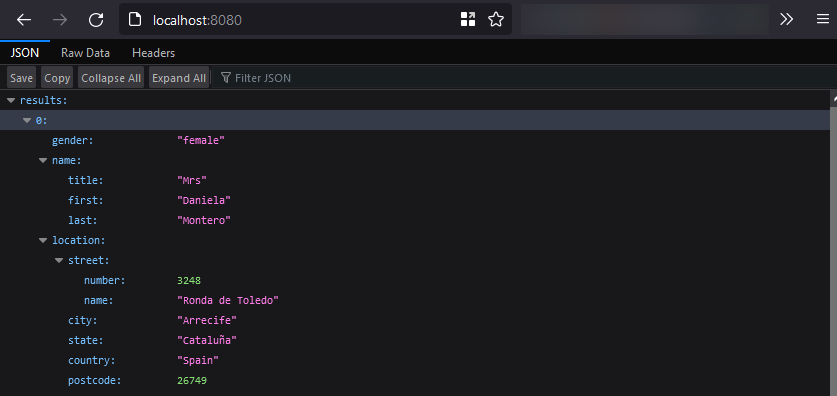

# Step 2: Dynamic HTTP server with express.js

Pour cette partie, nous avons choisi le framework Express.js et l’API [randomuser.me](http://randomuser.me).

Nous avons créé une image sur la base de l’image docker de nodejs version 16.

```docker
FROM node:16

# Create app directory
WORKDIR /usr/src/app

# Install app dependencies
# A wildcard is used to ensure both package.json AND package-lock.json are copied
# where available (npm@5+)
COPY package*.json ./

RUN npm install
# If you are building your code for production
# RUN npm ci --only=production

# Bundle app source
COPY . .

EXPOSE 8081
CMD [ "node", "server.js" ]
```

Pour ce faire, il faut en plus du présent fichier Dockerfile, un fichier package.json qui contient les packages npm à utiliser pour faire fonctionner le serveur js :

```json
{
    "name": "docker_web_app",
    "version": "1.0.0",
    "description": "Node.js on Docker",
    "author": "M. Chantemargue & C. Matrand",
    "main": "server.js",
    "scripts": {
        "start": "node server.js"
    },
    "dependencies": {
        "express": "^4.16.1",
        "request": "^2.88.2"
    }
}
```

1. Pour créer le docker à partir du fichier ci-contre (**Cette commande doit être exécutée dans le dossier contenant le fichier `Dockerfile`, soit, dans notre cas : step2**).

    ```bash
    docker build . -t step2
    ```

2. Pour exécuter le docker

    ```bash
    docker run *-p 8080:8081* -d step2 --name step2
    ```


## Résulat attendu

Après avoir effectué les présentes commandes, le comportement escompté est le suivant lorsque nous faisons cet appel [http://localhost:8080](http://localhost:8080) :

