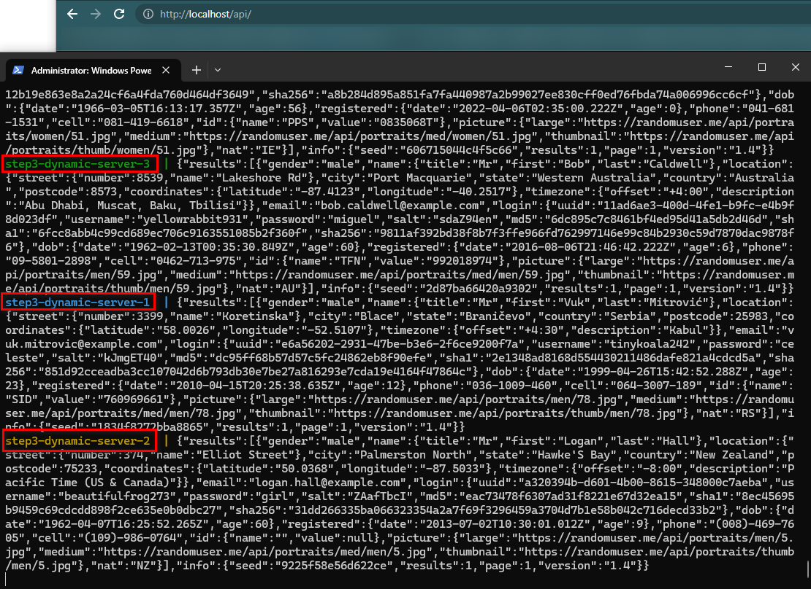

# Step 3: Build docker infrastructure with a reverse proxy

Avec docker compose, on va maintenant pouvoir déployer nos deux précédents serveurs web au sein d’une même infrastructure et à l’aide d’une seule commande.

Le`docker-compose.yml` effectue le déploiement de 3 images docker :

1. **static-server** : utilise la configuration du dockerfile de step1.

    Créé sur la base de step1, 3 images qui seront utilisées par le load balancer, lors de l’appel sur [/](http://localhost/).

2. **dynamic-server** : utilise la configuration dockerfile de step2.

    Créé sur la base de step1, 3 images qui seront utilisées par le load balancer, lors de l’appel sur [/api/](http://localhost/api/).

3. **traefik** : utilise l’image de traefik sur docker hub.

Les différentes commandes présentes dans le fichier sont documentées dans le fichier ci-contre.

```docker
version: "3.9"
services:
  # Static http server
  static-server:
    deploy:
      # Creates 3 replicas of this image, step 3a
      replicas: 3
    build: ../step1 # path where Dockerfile from step1 is stored
    volumes:
      - ../step1/public-html:/usr/local/apache2/htdocs/
    labels:
      - "traefik.http.services.static-server.loadbalancer.server.port=80" # Configures the load balancer with the image port of the image in step 1
      - "traefik.http.routers.static-server.rule=PathPrefix(`/`)"
  # Dynamic http server
  dynamic-server:
    # Creates 3 replicas of this image, step 3a
    deploy:
      replicas: 3
    build: ../step2 # path where Dockerfile from step1 is stored
    labels:
      - "traefik.http.services.dynamic-server.loadbalancer.server.port=8081" # Configures the load balancer with the image port of the image in step 2
      - "traefik.http.routers.dynamic-server.rule=PathPrefix(`/api/`)" # Replaces all request with /api/ by / as traefik does not know the path, then make a call to the js server created at step 2
      - "traefik.http.routers.dynamic-server.middlewares=replacepath"
      - "traefik.http.middlewares.replacepath.replacepath.path=/"
  # Dynamic http server
  reverse-proxy:
    # The official v2 Traefik docker image
    image: traefik:v2.9
    # Enables the web UI and tells Traefik to listen to docker
    labels:
      - "traefik.enable=true"
    command:
      - "--api.insecure=true"
      - "--api.debug=true"
      - "--api.dashboard=true"
      - "--providers.docker=true"
      - "--entryPoints.web.address=:80"
    ports:
      # The HTTP port
      - "80:80"
      # The Web UI (enabled by --api.insecure=true)
      - "8080:8080"
    volumes:
      # So that Traefik can listen to the Docker events
      - /var/run/docker.sock:/var/run/docker.sock
```

Après avoir créé ce fichier, exécutez, dans le même répertoire que celui-ci la commande suivante :

```bash
docker compose up -d
```

-d pour “detached mode” : lance les containers en arrière plan

## **Dynamic cluster management**

Lors de l’appel sur l’[/api/](http://localhost/api/), le load balancer va automatiquement rediriger les requêtes vers les différentes instances de dynamic-server créées, comme nous pouvons le voir ci-dessous.

## Résultat

