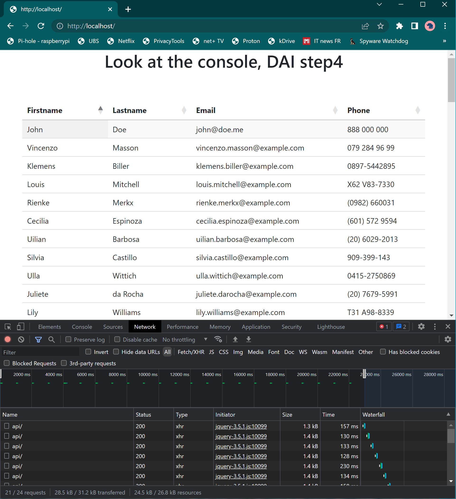

# Step 4: AJAX requests with Fetch API

Pour cette étape, nous allons utiliser jquery ainsi qu’ajax. Nous allons effectuer un appel (chaque n secondes) sur un serveur dynamique depuis un serveur statique. Tous deux sont déployés dans la même infrastructure à l’aide d’un fichier `docker-compose.yml`.

Pour se faire, il faut :

1. Une image docker similaire à l’étape 1, pour un serveur statique.

    Voici le contenu du `dockerfile` :

    ```docker
    FROM httpd:2.4
    COPY ./html/ /usr/local/apache2/htdocs/
    ```

2. Un dossier `html` contenant un fichier `index.html`

    ```html
    <html>

    <head>
       <script src="https://code.jquery.com/jquery-1.12.4.min.js"
          integrity="sha256-ZosEbRLbNQzLpnKIkEdrPv7lOy9C27hHQ+Xp8a4MxAQ=" crossorigin="anonymous"></script>
       <link rel="stylesheet" type="text/css" href="https://cdn.datatables.net/1.13.1/css/jquery.dataTables.css">

       <script src="https://code.jquery.com/jquery-3.5.1.js"></script>
       <script src="https://cdn.datatables.net/1.13.1/js/jquery.dataTables.min.js"></script>
       <script src="https://cdn.datatables.net/1.13.1/js/dataTables.bootstrap5.min.js"></script>
       <link rel="stylesheet" type="text/css"
          href="https://cdnjs.cloudflare.com/ajax/libs/twitter-bootstrap/5.2.0/css/bootstrap.min.css">
       <link rel="stylesheet" type="text/css" href="https://cdn.datatables.net/1.13.1/css/dataTables.bootstrap5.min.css">

       <script>

          $(document).ready(function () {
             $('#table_id').DataTable({
                "bPaginate": false,
                "bLengthChange": true,
                "bFilter": false,
                "bInfo": true,
                "bAutoWidth": true
             });
             var idx = 0;
             setInterval(ajax_query, 1000);
             function ajax_query() {
                $.ajax({
                   url: "/api/",
                   contentType: "application/json",
                   dataType: 'json',
                   success: function (d) { // call back on success
                      const data = JSON.parse(JSON.stringify(d)); // not clean but works
                      const firstname = data['results'][0]['name']['first'];
                      const lastname = data['results'][0]['name']['last'];
                      const email = data['results'][0]['email'];
                      const phone = data['results'][0]['phone'];
                      $("#table_id").find('tbody')
                         .append($('<tr>')
                            .append($('<td>').text(firstname)).append('</td>')
                            .append($('<td>').text(lastname)).append('</td>')
                            .append($('<td>').text(email)).append('</td>')
                            .append($('<td>').text(phone)).append('</td>')
                            .append('</tr>')
                         );
                   }
                });
             };
          });
       </script>
    </head>

    <body>
       <center>
          <h1>Look at the console, DAI step4</h1>
       </center>

       <div style="padding: 5%;">
          <table id="table_id" class="display">
             <thead>
                <tr>
                   <th>Firstname</th>
                   <th>Lastname</th>
                   <th>Email</th>
                   <th>Phone</th>
                </tr>
             </thead>
             <tbody>
                <tr>
                   <td>John</td>
                   <td>Doe</td>
                   <td>john@doe.me</td>
                   <td>888 000 000</td>
                </tr>
             </tbody>
          </table>
       </div>

    </body>

    </html>
    ```


Contenu du `docker-compose.yml` permettant de déployer toute l’infrastructure :

```docker
version: "3.9"
services:
  # Dynamic http server
  dynamic-server:
    build: ../step2 # path where Dockerfile from step1 is stored
    labels:
      - "traefik.http.services.dynamic-server.loadbalancer.server.port=8081" # Configures the load balancer with the image port of the image in step 2
      - "traefik.http.routers.dynamic-server.rule=PathPrefix(`/api/`)" # Replaces all request with /api/ by / as traefik does not know the path, then make a call to the js server created at step 2
      - "traefik.http.routers.dynamic-server.middlewares=replacepath"
      - "traefik.http.middlewares.replacepath.replacepath.path=/"
  # Ajax step 4
  static-server-ajax:
    # static http server with ajax requests
    build: ./ # path where Dockerfile from step4 is stored
    labels:
      - "traefik.http.services.static-server-ajax.loadbalancer.server.port=80" # Configures the load balancer with the image port of the image in step 4
      - "traefik.http.routers.static-server-ajax.rule=PathPrefix(`/`)"
  reverse-proxy:
    # The official v2 Traefik docker image
    image: traefik:v2.9
    # Enables the web UI and tells Traefik to listen to docker
    labels:
      - "traefik.enable=true"
    command:
      - "--api.insecure=true"
      - "--api.debug=true"
      - "--api.dashboard=true"
      - "--providers.docker=true"
      - "--entryPoints.web.address=:80"
    ports:
      # The HTTP port
      - "80:80"
      # The Web UI (enabled by --api.insecure=true)
      - "8080:8080"
    volumes:
      # So that Traefik can listen to the Docker events
      - /var/run/docker.sock:/var/run/docker.sock
```

## Résultat

Nous voyons, ci-dessous, tous les appels faits au serveur dynamique. Le contenu de la requête est projeté sous forme d’une nouvelle ligne dans le tableau de personne.

