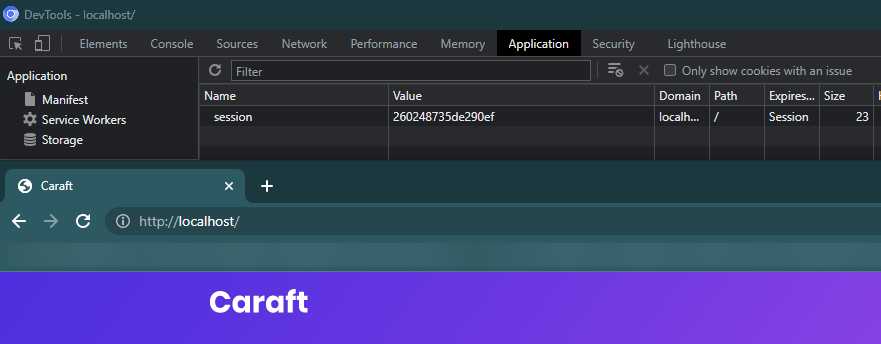

# Step 5: Load balancing: round-robin and sticky sessions

Le fichier `docker-compose.yml` suivant contient deux images de serveur, statique et dynamique respectivement.

Le serveur statique avec les sticky sessions d’activées et le dynamique en fonctionnement normal, soit Round Robin.

```docker
version: "3.9"
services:
  # Dynamic http server
  dynamic-server:
    deploy:
      # Creates 3 replicas of this image
      replicas: 3
    build: ../step2 # path where Dockerfile from step1 is stored
    labels:
      - "traefik.http.services.dynamic-server.loadbalancer.server.port=8081" # Configures the load balancer with the image port of the image in step 2
      - "traefik.http.routers.dynamic-server.rule=PathPrefix(`/api/`)" # Replaces all request with /api/ by / as traefik does not know the path, then make a call to the js server created at step 2
      - "traefik.http.routers.dynamic-server.middlewares=replacepath"
      - "traefik.http.middlewares.replacepath.replacepath.path=/"
  # Static http server
  static-server:
    deploy:
      # Creates 3 replicas of this image
      replicas: 3
    build: ../step1 # path where Dockerfile from step1 is stored
    volumes:
      - ../step1/public-html:/usr/local/apache2/htdocs/
    labels:
      - "traefik.http.services.static-server.loadbalancer.server.port=80"
      - "traefik.http.routers.static-server.rule=PathPrefix(`/`)"
      - "traefik.http.services.static-server.loadbalancer.sticky.cookie.name=session" # use for sticky session
  reverse-proxy:
    # The official v2 Traefik docker image
    image: traefik:v2.9
    # Enables the web UI and tells Traefik to listen to docker
    labels:
      - "traefik.enable=true"
    command:
      - "--api.insecure=true"
      - "--api.debug=true"
      - "--api.dashboard=true"
      - "--providers.docker=true"
      - "--entryPoints.web.address=:80"
    ports:
      # The HTTP port
      - "80:80"
      # The Web UI (enabled by --api.insecure=true)
      - "8080:8080"
    volumes:
      # So that Traefik can listen to the Docker events
      - /var/run/docker.sock:/var/run/docker.sock
```

## Test et validation

### Serveur statique

Pour valider le fonctionnement de notre implémentation des sticky sessions le serveur statique, nous l’avons lancé sur un navigateur et nous avons vérifié dans la console du docker que le serveur répondant était bien le même à chaque fois. Nous avons ensuite lancé le serveur sur d’autres navigateurs pour vérifier que le serveur pouvait être différent que le premier lancé sur l’autre navigateur. Mais qu’il restait le même lors des futures requêtes du moment qu’elles étaient faites sur le même navigateur.

Nous avons, par ailleurs, vérifié qu’un cookie de session était bien présent (voir ci-dessous).




### Serveur dynamique

Pour le serveur dynamique, qui est en round robin (par défaut), nous avons bien vérifié qu’il n’y avait pas de cookie (voir ci-dessous) contrairement aux sticky sessions.


Mais également que le serveur répondant aux appels changeait bien à chaque requête selon le principe de round robin (voir ci-dessous).

