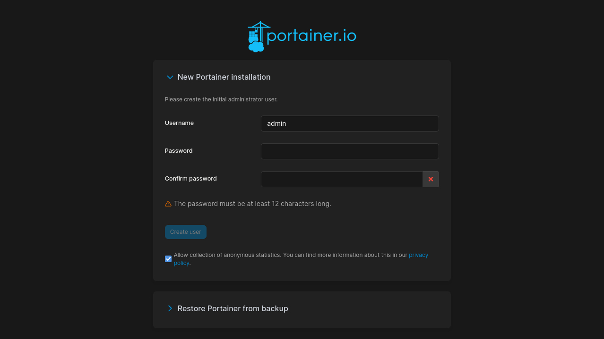

# Step 6: Management UI

Pour cette dernière étape, nous avons choisi d’utiliser et de déployer [Portainer](https://www.portainer.io/) pour gérer nos containers dynamiquement.

Notre `docker-compose.yml` pour Portainer :

```docker
version: "3"
services:
	portainer:
		image: portainer/portainer-ce:latest
		ports:
			- 9443:9443
		volumes:
			- data:/data
			- /var/run/docker.sock:/var/run/docker.sock
		restart: unless-stopped
volumes:
	data:
```

Pour lancer le docker compose :

```docker
docker compose up -d
```

## Accès à Portainer

On se connecte ensuite au port 9443 ( [https://localhost:9443](https://localhost:9443/) et pas un simple [localhost:9443](http://localhost:9443) ). Une page nous invite alors à nous inscrire (voir ci-dessous).



## Résultat

Après connection, en cliquant sur l’environnement local, on peut voir tous les containers docker en cours d’exécution sur la machine virtuelle. On peut ensuite les arrêter / démarrer mais aussi en ajouter et en enlever à notre guise depuis l’interface Portainer (voir ci-dessous).

